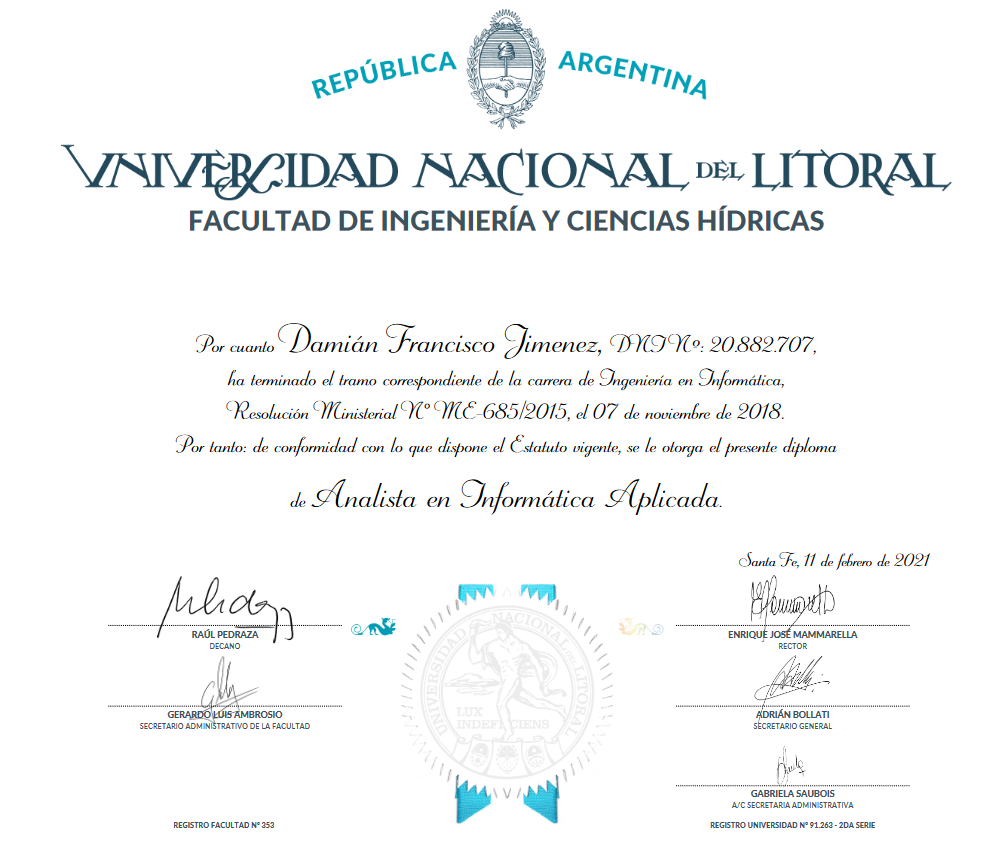
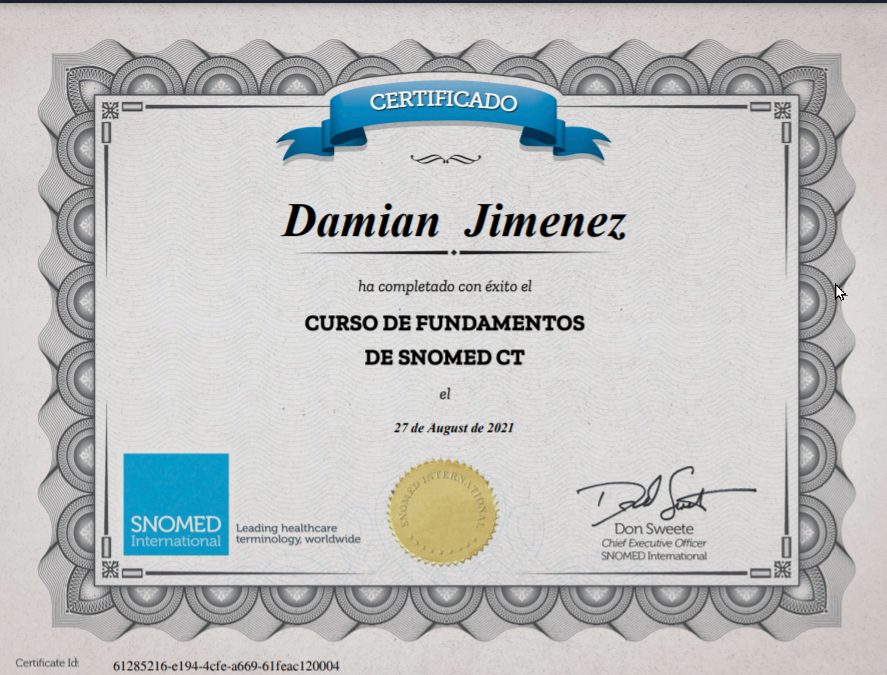
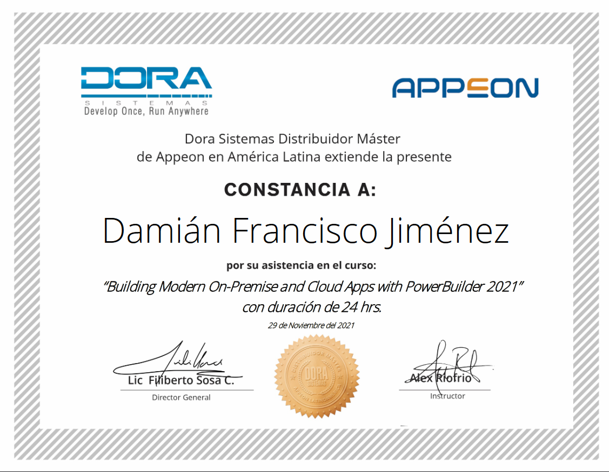
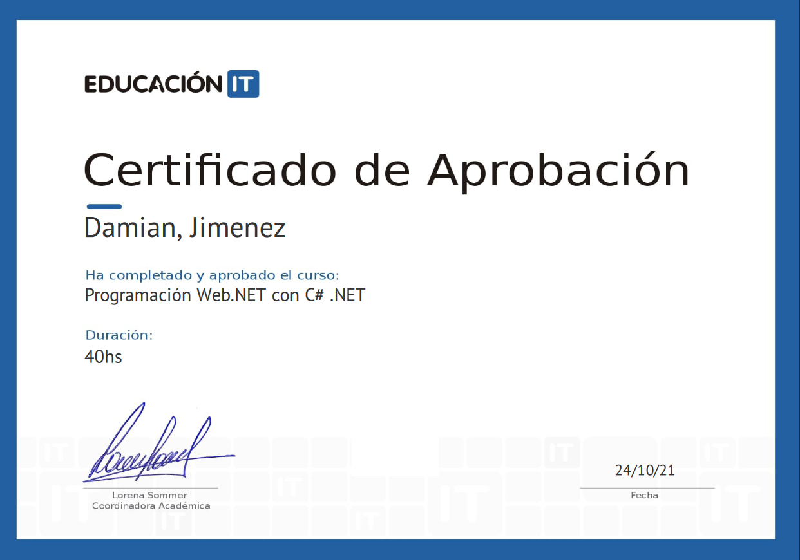
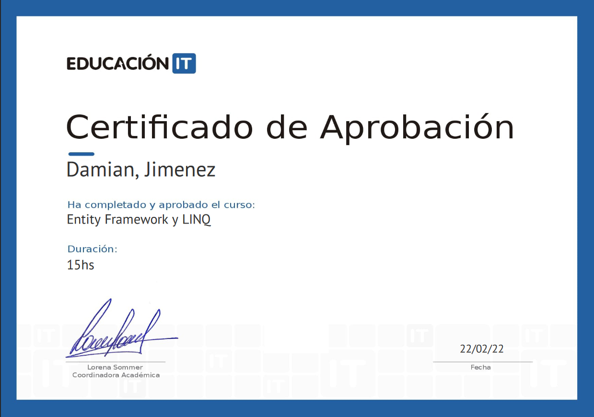
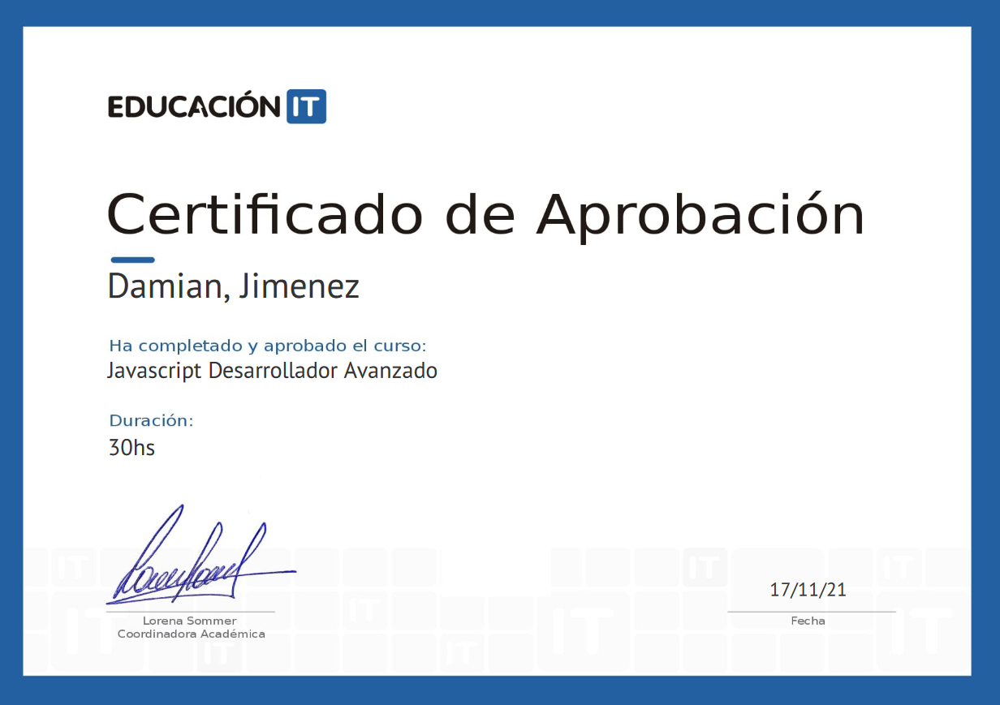
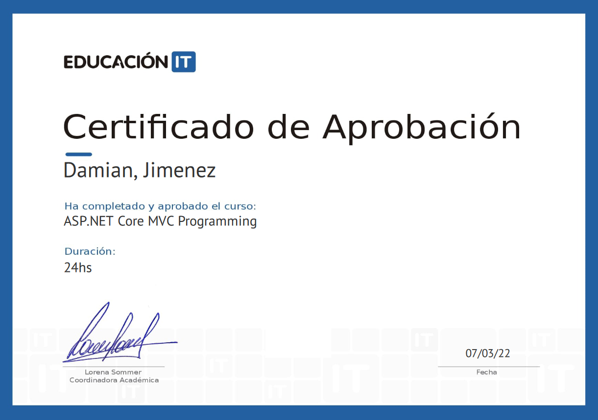
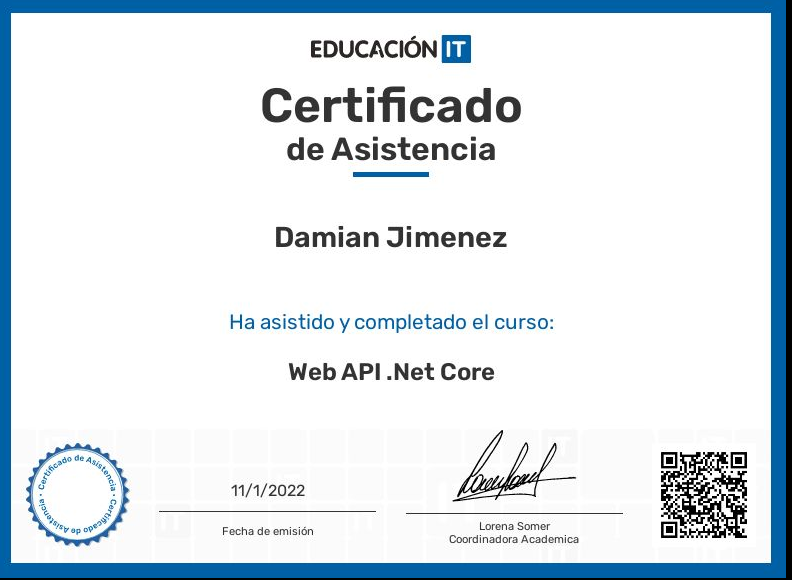

## Damián Jimenez
#### Sabypna@gmail.com - Paraná - Entre Rios - Argentina

 #### Intro
> A few years ago I finished my studies (while also working) that I had postponed due to other priorities, including a family business and my immediate family (I have a wife and two daughters). Since then I have been fully devoted to development, learning about new technologies to innovate as much as possible . And I love it. I want to continue on this path.

#### Skills

* Powerbuilder v2017 v2021  
* SQL Server PosgreSql MongoDB MariaDB CouchBase CouchDB
* .NET Javascript -SvelteJs - VueJs - NodeJS - TypeScript BootStrap - Tailwind
* IIS  - Kubernetes - NginX - Docker
* C# C++ VisualBasic VisualFoxpro Fortran Cobol Assembler Prolog (Andrid Studio NetBeans Eclipse VSC)

### History Work

|Puesto| Empresa |Años|
|:---|:---:|:----:|
|Wholesale retailer purchases payments soft-management( family business) |Marroquineria Los Norteños|1983-2001|
|Administration and IT teacher |System Paraná (Espanish Frnchise)|2002-2005|
|Management and customer service |Cyber La Esquina|2005-2008|
|Management and customer service|Casa Parque (Salón eventos)|2009-2015|
|Property management | third party company |2015-2020|
|software developer  | Integral Software |2020- today |

#### Educación

### Analista en Informática Aplicada - Universidad Nacional Litoral - Santa Fe.

#### Técnico en Computación - ENET Nº 1 - Paraná -Entre Rios

## that's all for now, to be continued
