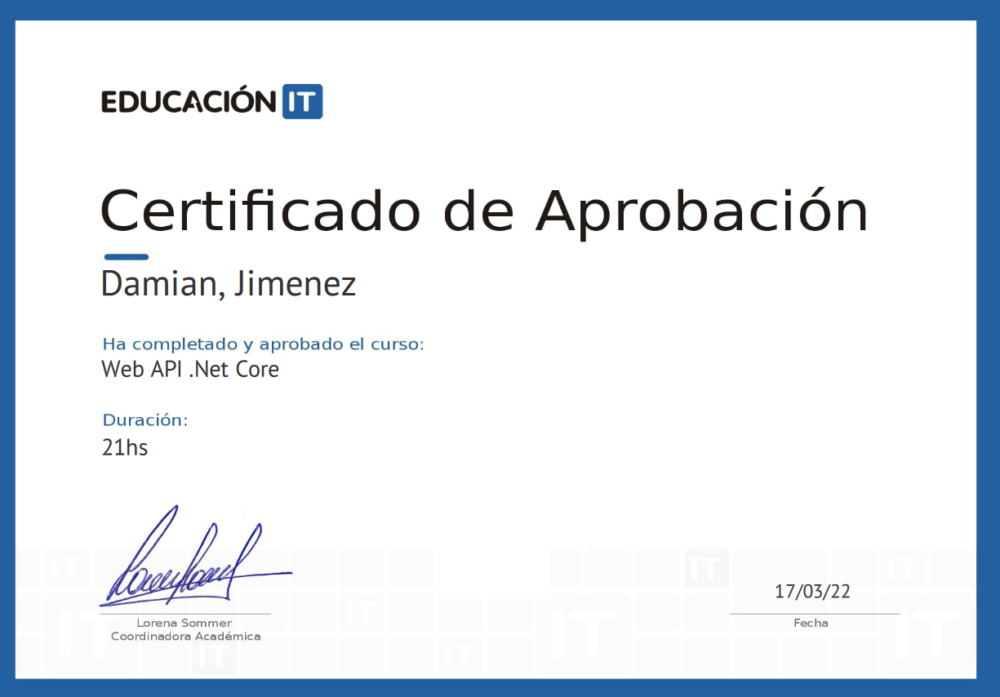
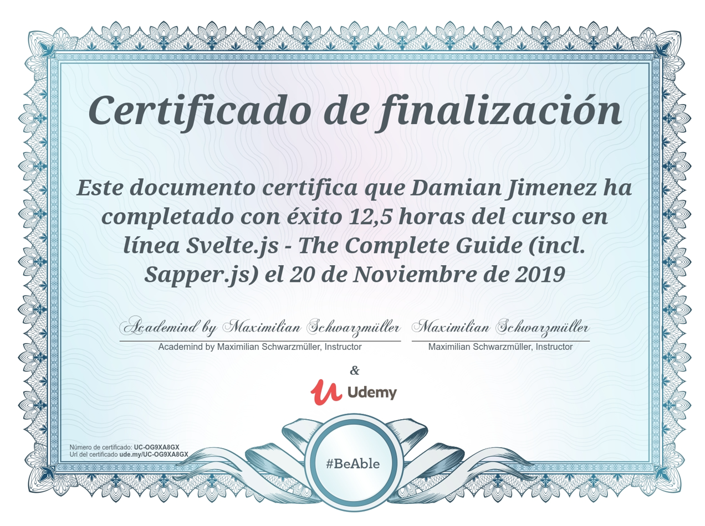
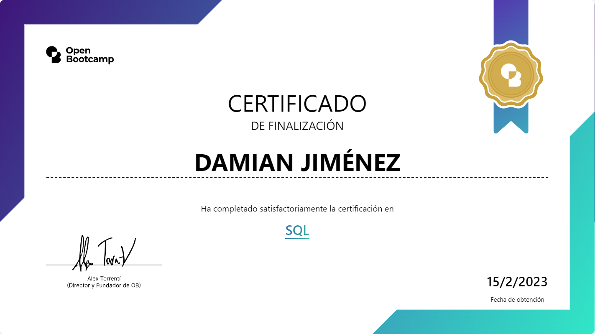
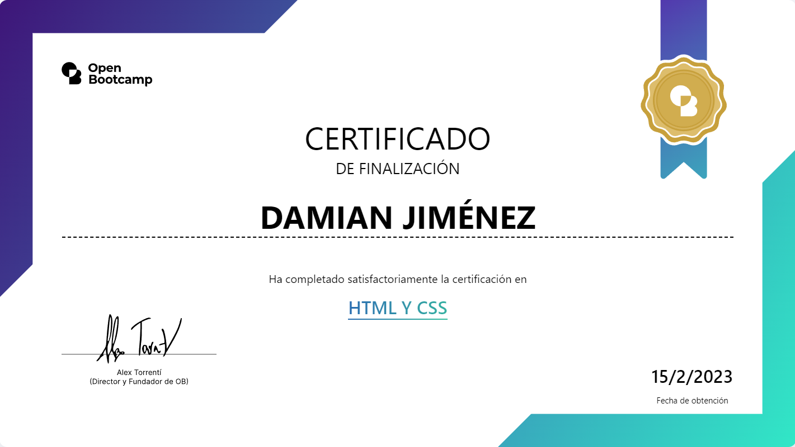
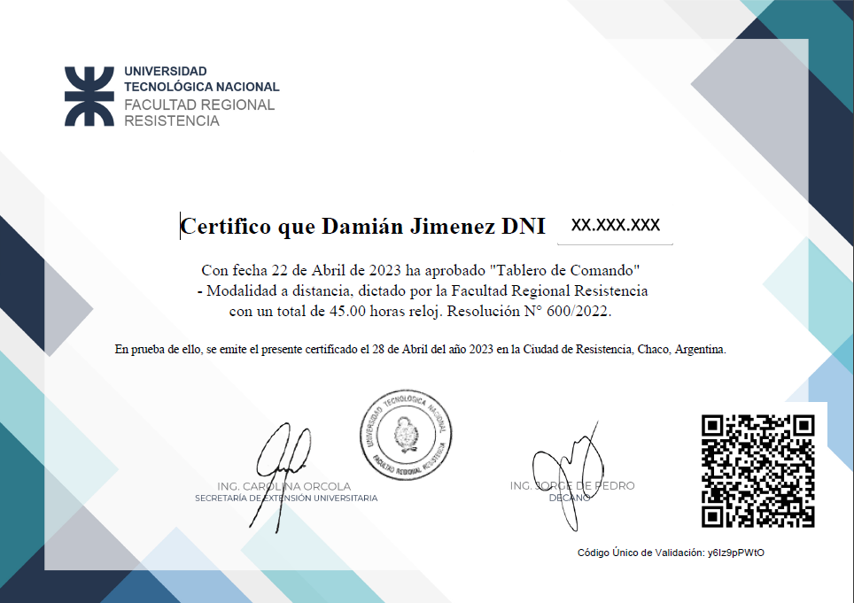
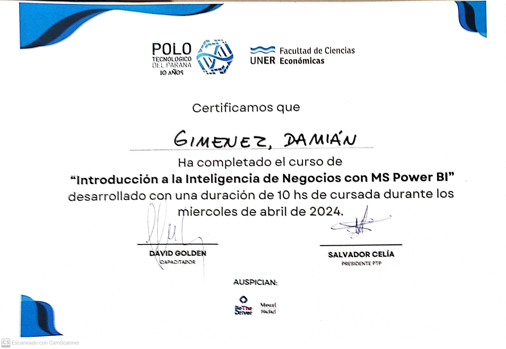

## Damián Jimenez
#### Paraná - Entre Rios - Argentina
Linkedin: https://www.linkedin.com/in/damianjimenezarg/  
Email: Sabypna@gmail.com
 #### Intro - Presentación
> I had three companies and I finished my career after starting a family. I am currently dedicated to software development. I like to study new technologies both in development and in information administration and management.

>Tuve tres empresas y me finalice mi carrera luego de formar na familia. Actualmente me dedico al desarrollo de software. Me gusta estudiar nuevas tecnologías tanto en desarrollo como en administración y menejo de información.

#### Skills - Habilidades

* Bussiness administration and optimization
* Powerbuilder v2017 to v2022 
*    (Migration to Powerserver)
* C# .NETcore MVC  Javascript Blazor Html CSS
* Power BI - SQL 
* REact Javscript Node Html CSS 

### History Work - Experiencias

|Job| Name Business | Years |
|:---:|:---:|:----:|
|Wholesale retailer purchases payments soft-management( family business) |Marroquineria Los Norteños|1983-2001|
|Administration and IT teacher |System Paraná |2002-2005|
|Management and customer service |Cyber La Esquina|2005-2008|
|Management and customer service|Casa Parque |2009-2015|
|Property management | third party company |2015-2020|
|software developer  | Integral Software |2020- October 2022 |
|software developer  | freelancer |November 2022 - today |
#### Educación

#### Analista en Informática Aplicada - Universidad Nacional Litoral - Santa Fe.

##### Técnico en Computación - ENET Nº 1 - Paraná -Entre Rios

# Certificates

